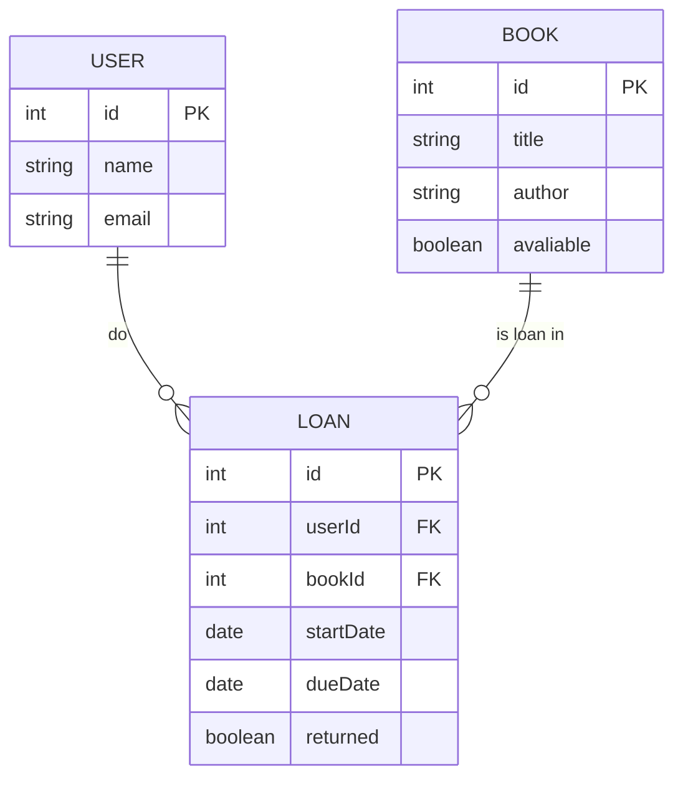
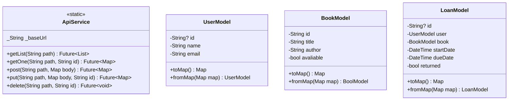

# Projeto Biblioteca APP Json

## 1. Identificação do Projeto

- **Nome do Projeto**: Biblioteca App
- **Descrição**: Aplicativo móvel multiplataforma (Flutter) para gerenciamento de bibliotecas, com funcionalidade de CRUD (Criar, Ler, Atualizar, Deletar) para usuários, livros e empréstimos.

## 2. Propósito e Escopo

O sistema tem como objetivo digitalizar e simplificar a gestão de acervos bibliotecários. Ele permite o cadastro e controle de livros, usuários e empréstimos, oferecendo uma interface intuitiva para administradores. O escopo atual inclui operações básicas de gerenciamento, com dados persistidos em um backend simulado via Json Server.

## 3. Requisitos Funcionais (RF)

| ID | Requisito | Descrição |
| - | - | - |
| RF01 | Gerenciar livros | Listar, cadastrar, editar e excluir livros do acervo |
| RF02 | Gerenciar usuários | Listar, cadastrar, editar e excluir usuários do sistema |
| RF03 | Gerenciar empréstimos de livros | Visualizar e gerenciar empréstimos de livros |
| RF04 | Navegação | Interface com navegação para abas ( livros, empréstimos, usuários) |

## 4. Requisitos Não Funcionais (RNF)

| ID | Requisito | Descrição |
| - | - | - |
| RNF01 | Arquitetura | Baseada em camadas (Model, Service, Controllers, Views) seguindo o padrão MVC. |
| RNF02 | Persistência | Utiliza um arquivo db.json como fonte de dados acessando via ApiRest |
| RNF03 | Tecnologia | Desenvolvimento em Flutter/Dart, com consumo de api via pacote http |
| RNF04 | Comunicação | A comunicação com o backend é feita através de requisições HTTP sincronas (GET, POST, PUT, DELETE) |

## 5. Endpoints da API (BackEnd)

| Método | Endpoint | Descrição |
| - | - | - |
| GET | /users | Lista todos os usuários |
| GET | /users/{id} | Busca um usuário po ID |
| POST | /users | Cria um novo usuário |
| PUT | /users/{id} | Atualiza um usuário |
| DELETE | /users/{id} | Remove um usuário |
| GET | /books | Lista todos os livros |
| GET | /books/{id} | Busca um livro por ID |
| POST | /books | Cria um novo livro |
| PUT | /books/{id} | Atualiza um livro |
| DELETE | /books/{id} | Remove um livro |
| GET | /loans | Lista todos os empréstimos |
| POST | /loans | Registra um novo empréstimo |

## 6. Diagramas 

### 6.1 Diagramas de Entidade Relacional (DER)

### 6.2 Diagrama de Classe

