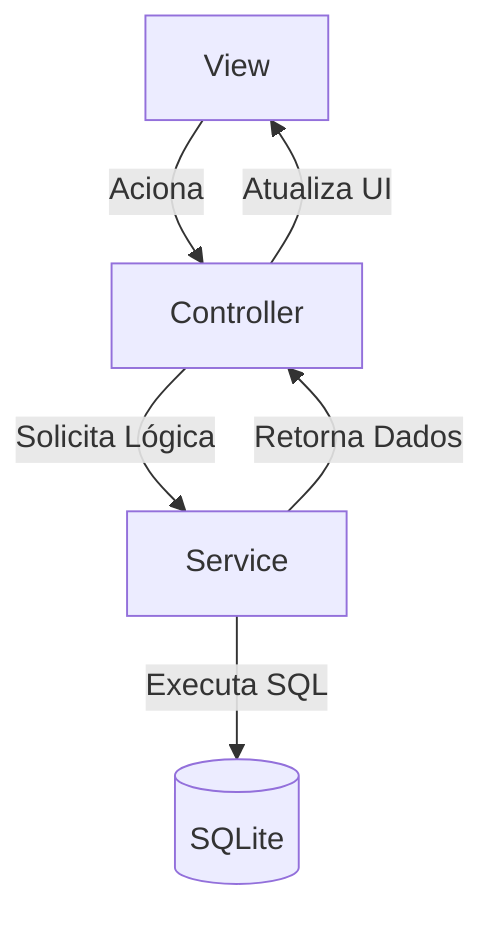
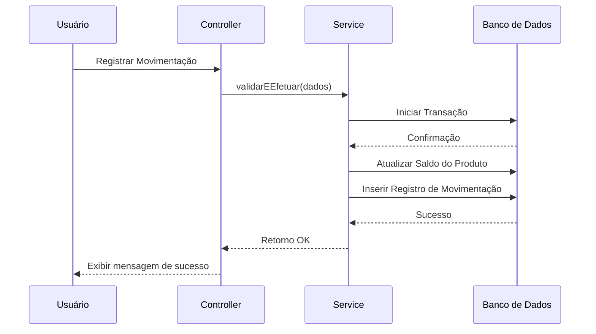
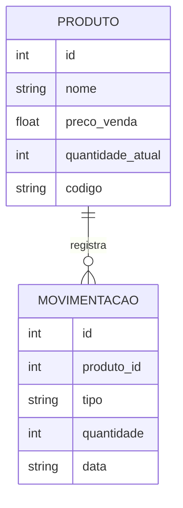

# EstoqueMais - Controle de Estoque Simples para Pequeno Negócio

Sistema de gerenciamento e controle de fluxo de estoque para pequenos negócios desenvolvido em Flutter. O aplicativo permite o cadastro detalhado de produtos e o registro histórico de entradas e saídas, utilizando persistência local com SQLite.

---

## 1. Visão Geral do Sistema (Escopo)
O **EstoqueMais** foi projetado para atender microempreendedores que necessitam de uma solução ágil, offline e confiável para monitorar seus produtos. O sistema garante o controle em tempo real do saldo de mercadorias, mitigando erros humanos comuns em anotações manuais, como a venda de itens sem estoque disponível.

---

## 2. Especificação de Requisitos

### 2.1. Requisitos Funcionais (RF)
Os requisitos funcionais descrevem as ações fundamentais que o sistema deve ser capaz de executar.

| Identificador | Descrição do Requisito | prioridade |
| :--- | :--- | :--- |
| **RF001** | O sistema **deve** permitir o cadastro de produtos informando: Nome, Descrição, Preço de Custo, Preço de Venda, Quantidade Inicial e Código (SKU/Barras). | Essencial |
| **RF002** | O sistema **deve** listar todos os produtos cadastrados em uma tela inicial de forma resumida (Nome, Código e Quantidade Atual). | Essencial |
| **RF003** | O sistema **deve** exibir uma tela de detalhes para um produto selecionado, mostrando todos os seus campos cadastrais e o seu histórico cronológico de movimentações. | Essencial |
| **RF004** | O sistema **deve** permitir o registro de movimentações de estoque vinculadas a um produto específico, contendo: Tipo (Entrada/Saída), Quantidade, Data/Hora e Observação. | Essencial |
| **RF005** | O sistema **deve** atualizar dinamicamente o saldo atual do produto na interface assim que uma movimentação for concluída com sucesso. | Essencial |

### 2.2. Requisitos Não-Funcionais (RNF)
Os requisitos não-funcionais definem critérios de propriedade e restrições do sistema.

*   **RNF001 (Persistência):** Os dados devem ser armazenados localmente no dispositivo utilizando o banco de dados relacional **SQLite** (`sqflite`).
*   **RNF002 (Arquitetura):** O código fonte deve seguir estritamente o padrão de projeto **MVC + Service** (Model-View-Controller-Service) para garantir modularidade.
*   **RNF003 (Concorrência/Integridade):** As atualizações de estoque baseadas em movimentações devem ser executadas dentro de uma transação SQL (`db.transaction`) para evitar inconsistência de dados.
*   **RNF004 (Ambiente Operacional):** O aplicativo deve ser compatível com sistemas operacionais Android (API 21+) e iOS (iOS 12+).

### 2.3. Regras de Negócio (RN)
*   **RN001 (Estoque Mínimo):** O sistema não deve permitir o registro de uma movimentação do tipo **Saída** se a quantidade informada for maior do que a quantidade atual em estoque do produto (estoque não pode ficar negativo).
*   **RN002 (Cálculo de Saldo):** 
    *   Uma movimentação de *Entrada* soma a quantidade movimentada à quantidade atual do produto.
    *   Uma movimentação de *Saída* subtrai a quantidade movimentada da quantidade atual do produto.

---

## 3. Estrutura do Projeto (MVC + Service)
Para simplificar a organização, consolidamos o acesso a dados e regras de negócio:

* **Models:** Entidades de dados.
* **Views:** Telas e interface do usuário.
* **Controllers:** Gerenciadores de estado das telas.
* **Services:** Regras de negócio e acesso direto ao banco (contendo o `banco_de_dados_helper.dart`).



3. Fluxo de Movimentação de Estoque
O fluxograma abaixo descreve a lógica aplicada ao registrar uma movimentação:



--- 

# 4. Modelagem de Dados

O banco de dados utiliza um relacionamento de **1 para N (Um para Muitos)**, onde um único produto possui um histórico vinculado de várias movimentações.

## 4.1. Esquema Relacional

### Tabela: `produtos`

Esta tabela armazena o cadastro centralizado de cada item do estoque.

| Coluna | Tipo | Restrições| Descrição|
| --- | --- | --- | --- |
| id | INTEGER | PRIMARY KEY, AUTOINCREMENT | Identificador único do produto |
| nome| TEXT| NOT NULL| Nome comercial do produto|
| descricao| TEXT| -| Detalhes adicionais|
| preco_custo| REAL| NOT NULL| Valor unitário pago pela empresa|
| preco_venda| REAL| NOT NULL | Valor unitário de venda|
| quantidade_atual | INTEGER | NOT NULL, DEFAULT 0| Saldo em estoque em tempo real|
| codigo| TEXT| UNIQUE, NOT NULL| Código (SKU/Barras) para busca rápida |

---

### Tabela: `movimentacoes`

Esta tabela mantém o histórico auditável de cada entrada ou saída realizada.

| Coluna     | Tipo    | Restrições                 | Descrição                     |
| ---------- | ------- | -------------------------- | ----------------------------- |
| id         | INTEGER | PRIMARY KEY, AUTOINCREMENT | Identificador da movimentação |
| produto_id | INTEGER | FOREIGN KEY, NOT NULL      | Referência ao `produtos(id)`  |
| tipo       | TEXT    | NOT NULL                   | `'ENTRADA'` ou `'SAIDA'`      |
| quantidade | INTEGER | NOT NULL                   | Quantidade movimentada        |
| data       | TEXT    | NOT NULL                   | Data/Hora no formato ISO 8601 |
| observacao | TEXT    | -                          | Motivo ou anotação extra      |

---

## 4.2. Estrutura das Tabelas (SQL)

A criação destas tabelas no banco de dados deve respeitar a integridade referencial:

```sql
-- Tabela de Produtos
CREATE TABLE produtos (
    id INTEGER PRIMARY KEY AUTOINCREMENT,
    nome TEXT NOT NULL,
    descricao TEXT,
    preco_custo REAL NOT NULL,
    preco_venda REAL NOT NULL,
    quantidade_atual INTEGER NOT NULL DEFAULT 0,
    codigo TEXT UNIQUE NOT NULL
);

-- Tabela de Movimentações
CREATE TABLE movimentacoes (
    id INTEGER PRIMARY KEY AUTOINCREMENT,
    produto_id INTEGER NOT NULL,
    tipo TEXT NOT NULL,
    quantidade INTEGER NOT NULL,
    data TEXT NOT NULL,
    observacao TEXT,
    FOREIGN KEY (produto_id) 
        REFERENCES produtos (id) 
        ON DELETE CASCADE
);
```

---

## 4.3. Diagrama Entidade-Relacionamento (Mermaid)

Este diagrama demonstra visualmente como a regra de negócio conecta as duas entidades:


