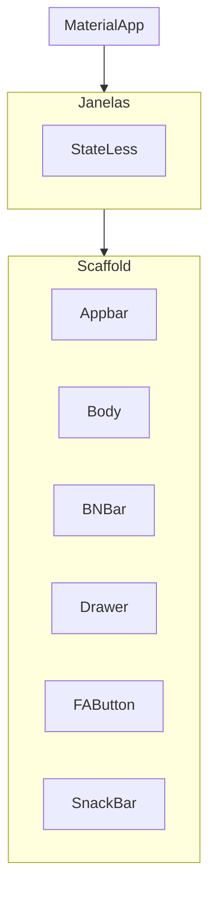

# Resumo da Aula

## Instalação e Configuração
- Instalamos o Git
- Instalamos o VS Code
- Conectamos o Git com o GitHub
- Configuramos perfis no VS Code
- Usamos Live Share para colaboração

## Configuração do Git

Executamos os seguintes comandos no terminal:

```bash
git config --global user.email "meu.email@email.com"
git config --global user.name "nome.no.git"
```

## Criação de Pastas pelo Terminal

```bash
cd doc
mkdir gabidev
cd gabidev
mkdir mobile
type nul > README.md
```


# Introdução ao Desenvolvimento Mobile

### Tipos de desenvolvimento 

- Nativo
    - Android:
        - SDK: Android SDK
        - IDE: Android Studio
        - Linguagens: Kotlin e Java
        - Ambientes: Mac, Win e Linux
    
    - iOS:
        - SDK: Cocoa Touch
        - IDE: Xcode
        - Linguagens: Swift / Objective-C
        - Ambiente: Mac

- Multiplataforma
    - React Native:
        - SDK: Node.js
        - IDE: VS Code,
        - Linguagem: JavaScript / TypeScript
        - Ambientes: Mac, Win e Linux

    - Flutter:
        - SDK: Flutter SDK
        - IDE: VS Code / Android Studio
        - Linguagem: Dart
        - Ambientes: Mac, Win e Linux

    ## Preparação do Ambiente de Desenvolvimento    

    ## Instalação do FLutterSDK
    - Download do arquivo ZIP na página flutter.dev
    - Inclusão do flutter na pasta C:\src
    - Inclusão do flutter\bin nas variáveis de ambiente
    - Teste o flutter --version

    ### Instalação do AndroidSDK
    - Download do AndroidSDK - Command Line Tools
    - Adicionar o Command-Line ao C:\src\AndroidSDK
    - Adicionar o SDKManager as Variáveis de Ambiente
    - Download dos pacotes:
        - emulator
        - platforms
        - platform-tools
        - build-tools
    - Adicionar ADB e o Emulator as Variáveis de Ambiente
    - Criação da Imagem do Emulador
    - Build do Emulador - via SDKManager

    ### Criação de Projeto e Códigos da Linha de Comando

    - Criação de Pojetos
        - flutter create nome_do_app
            - Flags:
                - --empt: cria um aplicativo "vazio"(hello world)
                - --platforms: permite a seleção de uma plataforma de desenvolvimento
                    - Exemplo: --platforms=android (a criação do projeto será somente para a plataforma android)
        - exemplo de criação de um aplicativo android vazio
            - flutter create nome_do_app --empty --platforms=android
            - obs: nome do aplicativo: todas as letras minúsculas, separação de palavras com "_";
            - permite correção de pequenos problemas no flutter e idenificação dos parâmetros
            funcionais em relação as plataformas de desenvolvimento
            - sempre rodar o flutter doctor no começo do desenvolvimento
        - flutter clean
            - limpa cache do build (apaga o apk anterior)
        - flutter run -v
            - build do app (apk)
    - Gerenciamento de dependências do PubSpec()
        - Instalação
            - flutter pub add nome_dependencia
        - baixar e instalar dependências projetadas
            - flutter pub get
        - Outros comandos do flutter pub(dependências)
            - flutter pub outdated (verifica se as dependências estão desatualizadas)
            - flutter pub upgrade (atualiza as dependências do flutter pub)

### Estrutura Básica de um Aplicativo em Flutter

#### Árvore de Widgets



             
    
